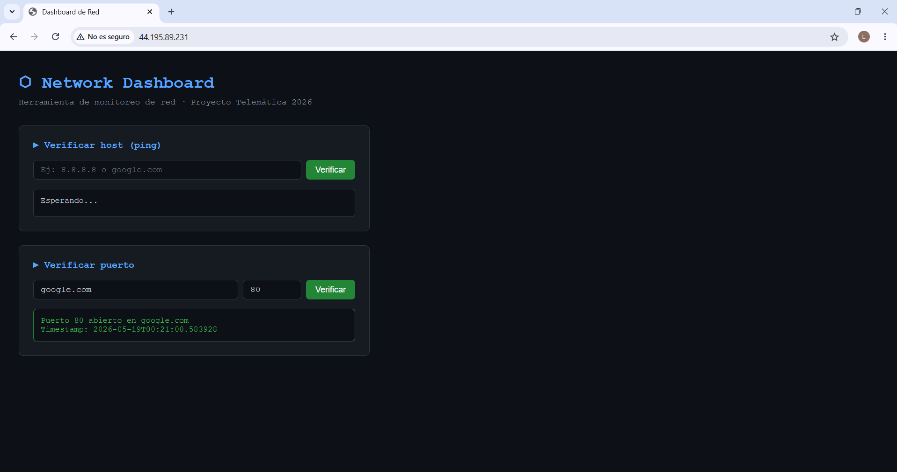
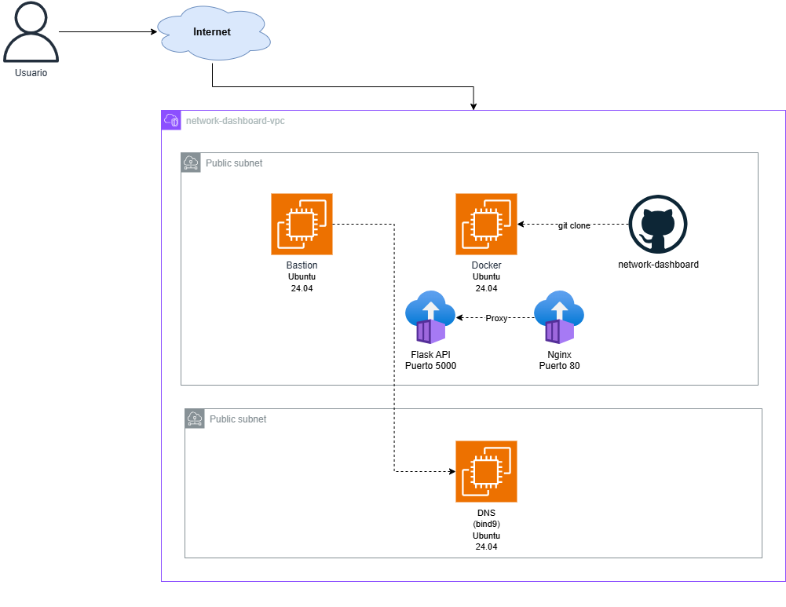

<div align="center">
  

  <h1>Network Dashboard</h1>

  <p>Herramienta de monitoreo de red desplegada con Docker sobre infraestructura AWS.<br>
  Permite verificar conectividad de hosts y disponibilidad de puertos desde una interfaz web,<br>
  usando Nginx como reverse proxy y Flask como backend.</p>

  <p>
    
    
    
    
    
  </p>

  <p><strong>Telemática 2026 — Ingeniería · Universidad Pontificia Bolivariana</strong></p>
</div>

---

## Vista previa

<div align="center">
  
</div>

---

## Tecnologías

| Componente | Tecnología |
|---|---|
| Backend | Python 3.11 + Flask |
| Reverse proxy | Nginx |
| Contenedores | Docker + Docker Compose |
| Infraestructura | AWS EC2 + VPC |
| DNS | bind9 |
| Control de versiones | GitHub |

---

## Arquitectura

<div align="center">
  
</div>

<br>

La infraestructura vive dentro de una VPC en AWS y está compuesta por tres instancias EC2:

- **Bastión** — instancia en subred pública. Único punto de entrada SSH a toda la red. Las instancias privadas solo son accesibles a través de él.

- **Docker Host** — instancia en subred pública con puerto 80 expuesto. Orquesta dos contenedores con Docker Compose:
  - `nginx` — recibe tráfico HTTP en el puerto 80 y lo redirige al contenedor Flask.
  - `app` — API Flask en el puerto 5000, accesible únicamente desde la red interna de Docker.

- **DNS (bind9)** — instancia en subred privada. Resuelve nombres del dominio `network-dashboard.local`. Solo accesible vía SSH a través del bastión.

### Registros DNS configurados

| Nombre | Tipo | IP |
|---|---|---|
| `docker.network-dashboard.local` | A | `10.0.12.205` |
| `dns.network-dashboard.local` | A | `10.0.134.87` |

---

## Estructura del repositorio

```
network-dashboard/
├── docker-compose.yml        # Orquesta los contenedores Flask + Nginx
├── README.md
├── .gitignore
├── docs/                     # Capturas e imágenes del proyecto
├── nginx/
│   └── nginx.conf            # Configuración del reverse proxy
└── app/
    ├── Dockerfile            # Imagen del contenedor Flask
    ├── requirements.txt      # Dependencias Python
    ├── app.py                # API Flask con endpoints de monitoreo
    └── templates/
        └── index.html        # Dashboard web
```

---

## Endpoints de la API

| Método | Ruta | Descripción |
|---|---|---|
| `GET` | `/` | Sirve el dashboard web |
| `GET` | `/api/check?host=<host>` | Verifica conectividad TCP al host |
| `GET` | `/api/port?host=<host>&port=<port>` | Verifica si un puerto está abierto |
| `GET` | `/api/status` | Estado general del servicio |

### Ejemplos

```bash
# Verificar conectividad a un host
curl http://<IP_PUBLICA>/api/check?host=google.com

# Verificar si un puerto está abierto
curl http://<IP_PUBLICA>/api/port?host=google.com&port=443

# Estado del servicio
curl http://<IP_PUBLICA>/api/status
```

---

## Despliegue en producción

### Requisitos previos

- Cuenta AWS con VPC configurada (subred pública y privada)
- Instancia EC2 Ubuntu 24.04 en la subred pública
- Puerto 80 abierto en el security group
- Git instalado en la instancia

### Paso 1 — Instalar Docker en la instancia EC2

```bash
sudo apt update && sudo apt upgrade -y
sudo apt install docker-compose -y
```

Verificar instalación:

```bash
sudo docker --version
sudo docker compose version
```

### Paso 2 — Clonar el repositorio

```bash
git clone https://github.com/Ikeracevedo/network-dashboard.git
cd network-dashboard
```

### Paso 3 — Levantar los contenedores

```bash
sudo docker compose up --build -d
```

Este comando:
1. Construye la imagen de Flask desde el `Dockerfile`
2. Descarga la imagen de Nginx desde Docker Hub
3. Levanta ambos contenedores en background
4. Los conecta en una red interna de Docker

### Paso 4 — Verificar que está corriendo

```bash
sudo docker ps
```

Deberías ver dos contenedores activos:

```
network-dashboard-nginx
network-dashboard-app
```

### Paso 5 — Acceder al dashboard

```
http://<IP_PUBLICA_EC2>
```

---

## Comandos útiles

```bash
# Ver logs en tiempo real
sudo docker compose logs -f

# Detener los contenedores
sudo docker compose down

# Reconstruir y reiniciar
sudo docker compose up --build -d

# Ver estado de los contenedores
sudo docker ps

# Ver uso de recursos
sudo docker stats
```

---

## Nota sobre verificación de hosts

> En entornos cloud como AWS Academy, el protocolo ICMP (ping) está bloqueado a nivel de red.
> Por esta razón, el verificador de hosts usa conexiones TCP al puerto 80 en lugar de ping
> tradicional. Este es el comportamiento estándar en infraestructuras de producción donde
> ICMP suele estar restringido por políticas de seguridad.

---

## Autor

**Iker Acevedo**  
Ingeniería · Universidad Pontificia Bolivariana  
Telemática 2026
